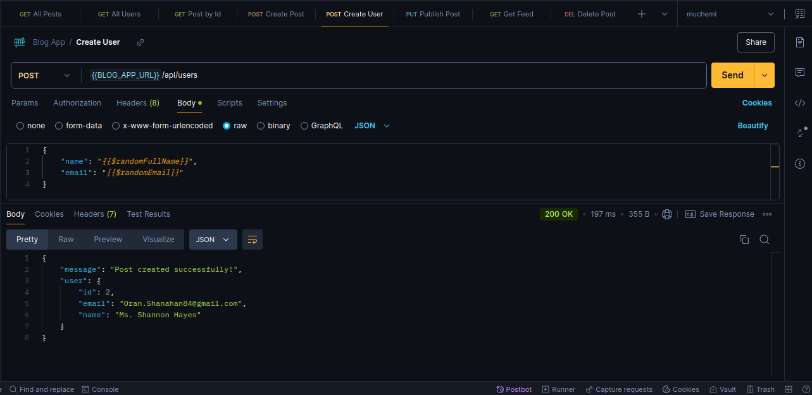
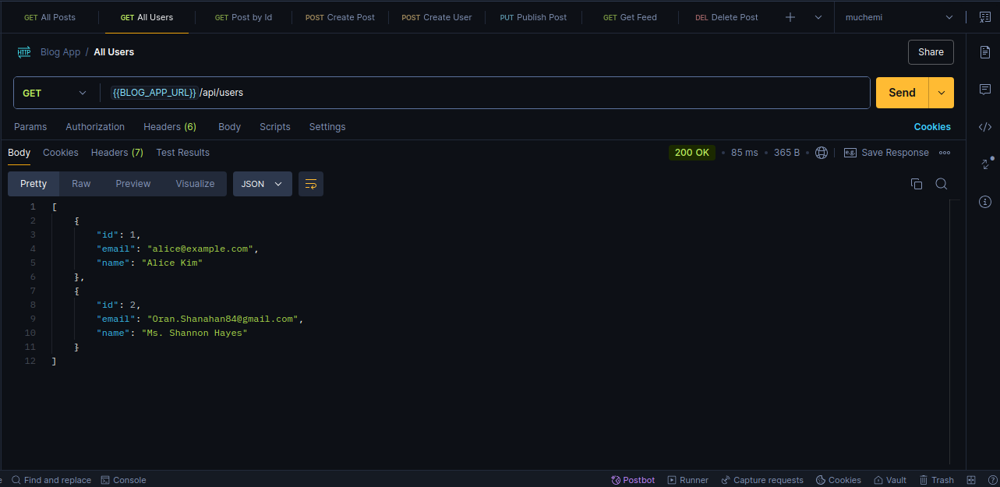
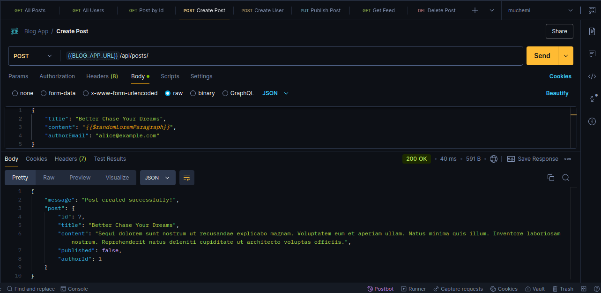
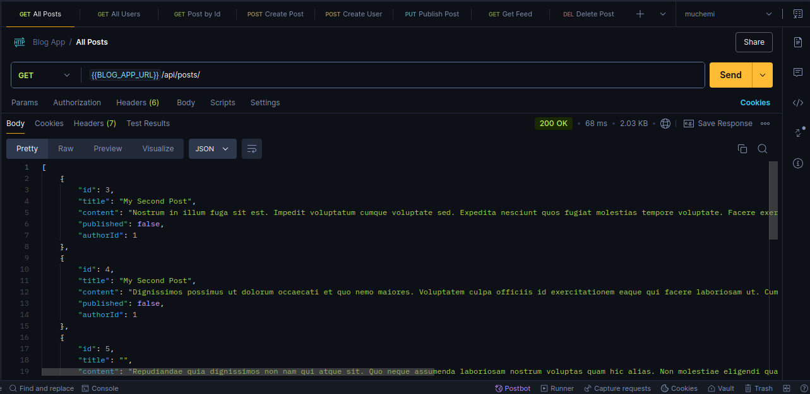
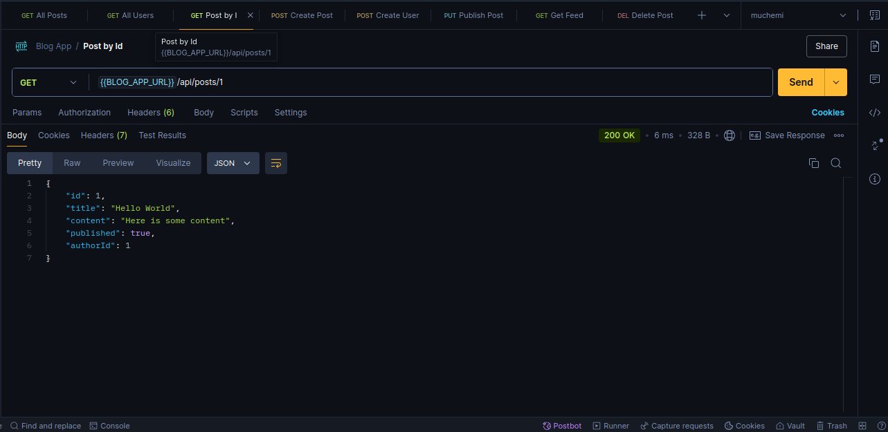
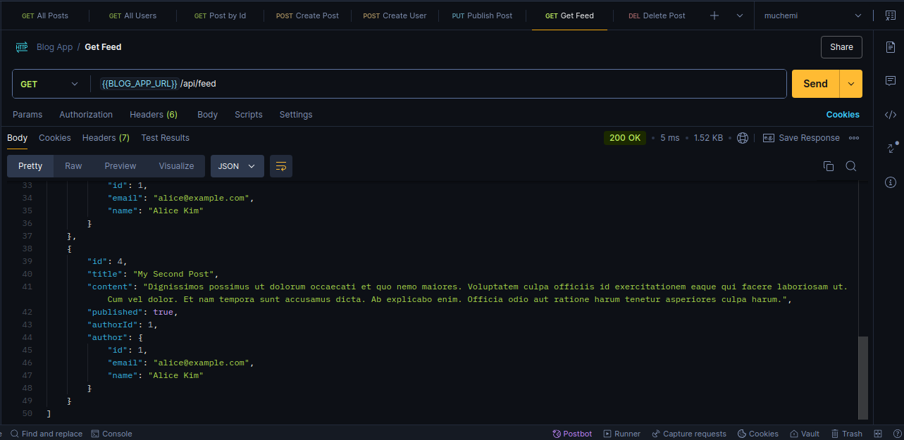
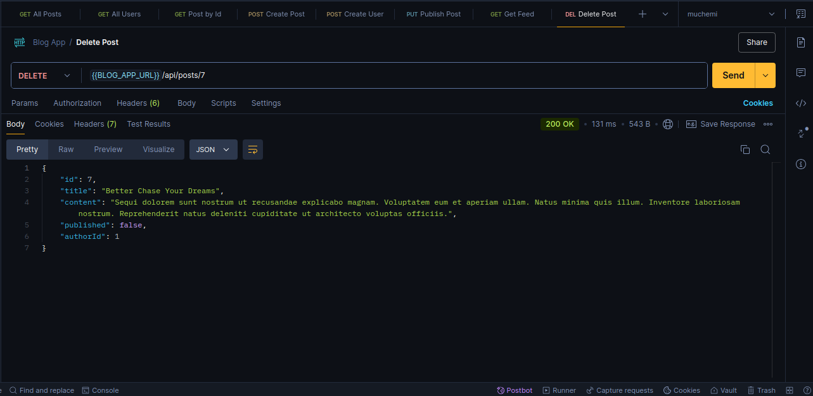

# Blog App

This is a simple blog app that allows users to create, read, publish and delete blog posts. The app is built using [express](https://expressjs.com/) and [TypeScript](https://www.typescriptlang.org/).

## Installation

1. Clone the parent repository and move into the blog-app directory.

```bash
git clone https://www.github.com/symonmuchemi/express.git

cd express/blog-app
```

1. Install the project dependencies.

```bash
pnpm install
```

1. Start the development server.

```bash
pnpm run dev
```

1. Navigate to `http://localhost:3000` in your browser to view the app.

## Features

The app has the following features:

- [x] Create a new user.
- [x] Fetch all users.
- [x] Fetch a single user by ID.
- [x] Create a new blog post.
- [x] Fetch all blog posts.
- [x] Fetch a single blog post by ID.
- [x] Publish a blog post.
- [x] Fetch all published blog posts.
- [x] Delete a blog post.
- [ ] Register a user.
- [ ] Login a user.

## Routes

The app has the following routes:

### Blog Posts

1. `GET /api/posts` - Fetch all blog posts.
2. `POST /api/posts` - Create a new blog post.
3. `GET /api/posts/:id` - Fetch a single blog post.
4. `GET /api/feed` - Fetch all published blog posts.
5. `DELETE /api/posts/:id` - Delete a blog post.

### Users

1. `GET /api/users` - Fetch all users.
2. `GET /api/users/:id` - Fetch a single user.
3. `POST /api/users` - Create a new user.

## Screenshots

### Create User



### All Users



### Create Post



### All Posts



### Post by ID



### Get Feed



### Delete Post


